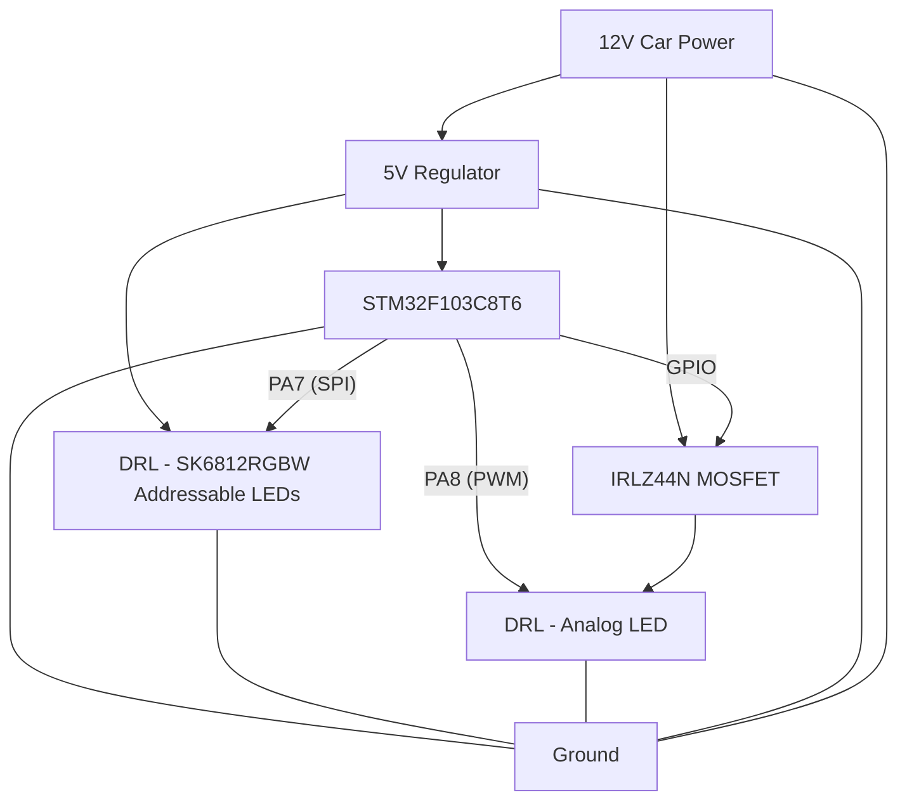

# Wiring Diagram (Markup)

Below is a markup representation of the wiring for the STM32F103C8T6 DRL controller (SK6812RGBW + analog LED):

## Resistor Placement
- **Data line (PA7 to SK6812):** Place a 330Ω resistor in series to the data input of the first SK6812 LED. This helps protect against voltage spikes and reflections.
- **Analog LED (MOSFET drain to LED cathode):** Use a current-limiting resistor sized for your LED and supply voltage. For a 5V supply and typical yellow/orange LED (2V forward voltage, 20mA):
  - R = (5V - 2V) / 0.02A = 150Ω (use 150Ω or 180Ω for safety)
- **Capacitor:** Place a 470uF or larger electrolytic capacitor across 5V and GND near the SK6812 power input to prevent brownouts.

> For a detailed schematic, use a tool like KiCad or EasyEDA.
