# Wiring Diagram (Markup)

Below is a markup representation of the wiring for the STM32F103C8T6 DRL controller (SK6812RGBW + analog LED, dual mirrored headlights):

## 1. Automotive-Grade Power Supply System ⚡

```mermaid
graph LR
    subgraph INPUT ["🔌 12V Car Input"]
        VIN[12V Car Battery<br/>9-16V Range<br/>Dirty Power]
    end
    
    subgraph PROTECTION ["🛡️ Input Protection"]
        FUSE[10A Automotive Fuse<br/>Short Circuit Protection]
        TVS[P6KE18A TVS Diode<br/>Voltage Spike Clamp]
        PMOS[P-Channel MOSFET<br/>Reverse Polarity Protection]
        BUCK[LM2596 Buck Converter<br/>5V 3A Output<br/>Automotive Grade]
    end
    
    VIN -->|Hot Wire| FUSE
    FUSE --> TVS
    TVS --> PMOS
    PMOS -->|Protected 12V| BUCK
    VIN -.->|Ground| PROTECTION
    
    classDef inputStyle fill:#ff5722,stroke:#d84315,stroke-width:3px,color:#fff
    classDef protStyle fill:#e91e63,stroke:#ad1457,stroke-width:3px,color:#fff
    
    class INPUT inputStyle
    class PROTECTION protStyle
```

## 2. Safe Microcontroller Power & Logic Levels 🧠

## 3. Reliable SK6812 DRL Data Path 💡

## 4. Safe Turn Signal MOSFET Circuit 🔶

```mermaid
graph LR
    subgraph CTRL ["🧠 STM32 Safe Control"]
        STM32[PA8: Left PWM<br/>PB6: Right PWM<br/>PA0/PA1: MOSFET Gates<br/>Protected Outputs]
        R_GATE[100Ω Gate Resistors<br/>Inrush Limiting]
        R_PULLDOWN[10kΩ Pull-down<br/>Gate Safety]
    end
    
    subgraph TURN ["🔶 Turn Signal Circuit"]
        MOSFET[IRLZ44N MOSFETs<br/>Logic Level<br/>Safe Gate Control]
        R_LED[150Ω Resistors<br/>Current Limiting]
        ANALOG[Yellow/Orange LEDs<br/>Turn Signal Indicators]
    end
    
    STM32 -->|3.3V Safe| R_GATE
    R_GATE -->|Limited Current| MOSFET
    R_PULLDOWN -.->|Gate Pull-down| MOSFET
    MOSFET -->|Switched 12V| R_LED
    R_LED -->|20mA Limited| ANALOG
    
    classDef mcuStyle fill:#2196f3,stroke:#0277bd,stroke-width:3px,color:#fff
    classDef turnStyle fill:#ff9800,stroke:#ef6c00,stroke-width:3px,color:#fff
    
    class CTRL mcuStyle
    class TURN turnStyle
```

### 🔄 Critical Safety Notes:
- **NEVER use AMS1117 in automotive applications** - it will fail immediately
- **Input protection is MANDATORY** - voltage spikes will destroy unprotected circuits
- **Logic level shifting is REQUIRED** - 3.3V won't reliably drive 5V LEDs
- **MOSFET gate protection prevents random activation** - essential for safety

## ⚠️ Automotive Safety Requirements

### Input Protection Circuit (MANDATORY)
| Component | Part Number | Purpose | Failure Mode Without |
|-----------|-------------|---------|----------------------|
| Fuse | 10A Automotive Blade | Short circuit protection | Fire hazard from overcurrent |
| TVS Diode | P6KE18A | Voltage spike clamp | Component destruction from load dump |
| P-MOSFET | FQP27P06 | Reverse polarity protection | Instant failure if battery connected backwards |
| Buck Converter | LM2596 Module | Efficient voltage regulation | Overheating and failure with linear regulators |

### Logic Level Translation (REQUIRED)
- **74HCT125 Quad Buffer**: Converts 3.3V MCU signals to 5V for reliable SK6812 control
- **Without level shifting**: LEDs will flicker, show wrong colors, or not work at all
- **Power supply**: 74HCT125 must be powered from 5V rail, not 3.3V

### MOSFET Gate Protection (SAFETY CRITICAL)
- **100Ω Series Resistor**: Limits gate charging current, protects MCU output
- **10kΩ Pull-down Resistor**: Ensures MOSFET stays OFF during power-up/reset
- **Without gate protection**: Turn signals may activate randomly, creating safety hazard

## Component Details

### Pin Assignments (Unchanged)
| Function | STM32 Pin | Description |
|----------|-----------|-------------|
| Left DRL Data | PA7 | SPI1 MOSI → 74HCT125 → SK6812RGBW |
| Right DRL Data | PB5 | SPI2 MOSI → 74HCT125 → SK6812RGBW |
| Left Turn Signal | PA8 | PWM → 100Ω → MOSFET gate |
| Right Turn Signal | PB6 | PWM → 100Ω → MOSFET gate |
| Left MOSFET Gate | PA0 | GPIO → 100Ω → MOSFET gate |
| Right MOSFET Gate | PA1 | GPIO → 100Ω → MOSFET gate |

### Updated Component Values
- **Data Line Resistors (330Ω)**: After level shifter, protects 5V signals
- **Gate Series Resistors (100Ω)**: NEW - protects MCU from gate charging current
- **Gate Pull-down Resistors (10kΩ)**: NEW - prevents floating gate during startup
- **Current Limiting Resistors (150Ω)**: For 12V supply: R = (12V - 2V) / 0.02A = 500Ω (use 470Ω)

### Power Supply Specifications
- **Input Voltage Range**: 9-16V (handles car's voltage variations)
- **Buck Converter**: LM2596-based module, 92% efficiency, 3A output capability
- **Input Protection**: Handles ±40V spikes, reverse polarity, overcurrent
- **Heat Management**: Buck converter stays cool vs. linear regulator overheating

### Capacitor Requirements (Updated)
- **Power Decoupling (1000µF + 100nF)**: Larger bulk capacitance for LED current spikes
- **Input Filtering**: 470µF after protection circuit, before buck converter
- **74HCT125 Bypass**: 100nF ceramic capacitor near each buffer IC

> For a detailed schematic, use a tool like KiCad or EasyEDA.
